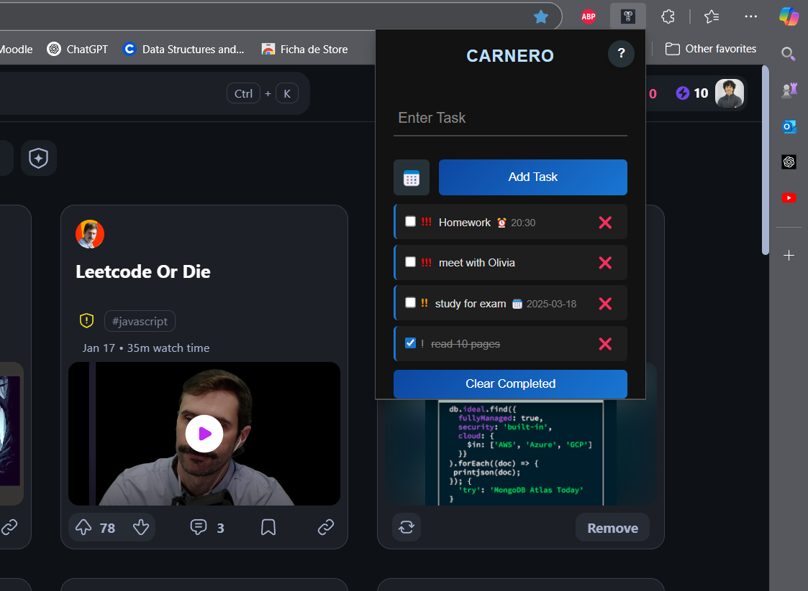
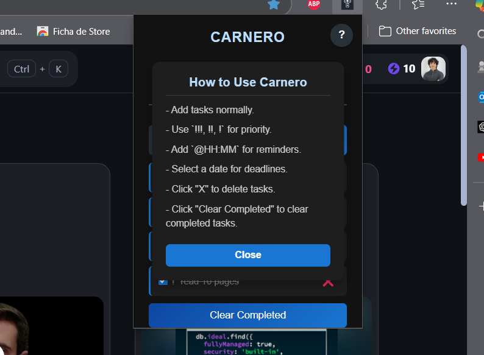

# Todo-shit-app

A minimalist yet powerful task manager Chrome extension designed for pure productivity.  
It helps you stay focused by managing tasks, setting reminders, and minimizing distractions with a focus mode.

## Features
- Task Manager – Add, delete, and check off tasks with ease.
- Smart Reminders – Set alarms for tasks (e.g., "Study @10:30").
- Persistent Notifications – Receive Chrome notifications for reminders.
- Automatic Task Syncing – Tasks are saved in `chrome.storage.local`, so they persist even when you close the extension.
- Real-Time Updates – Tasks marked as complete via notifications update instantly in the UI.
- Upcoming: Focus Mode – Block distracting websites to stay locked in.

